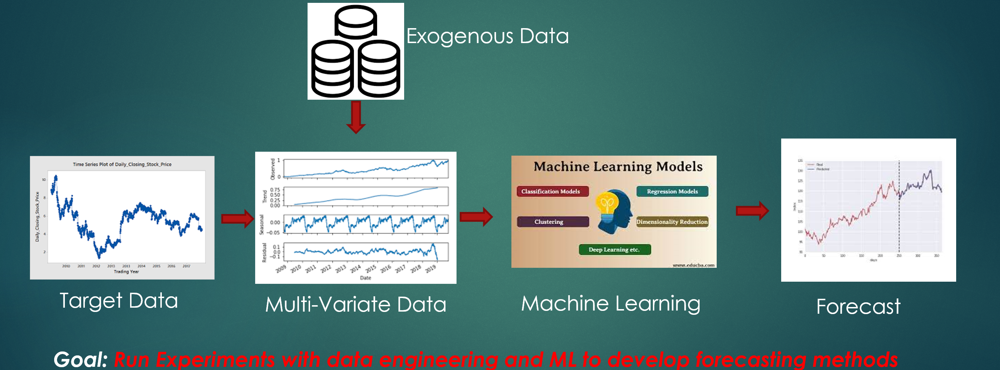
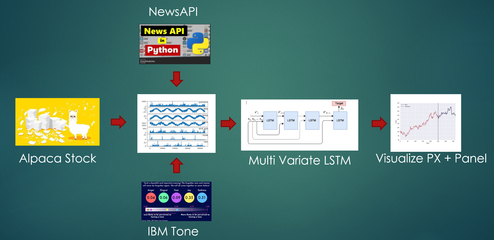
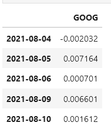
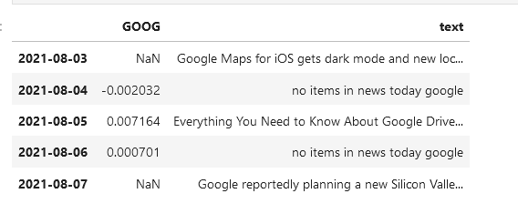
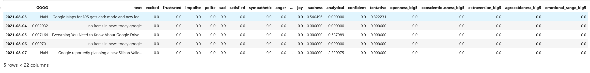
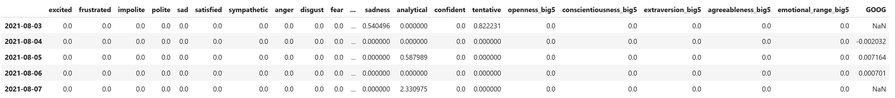
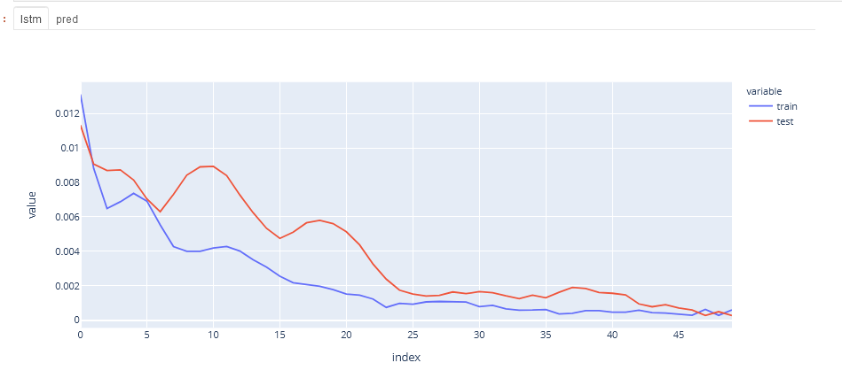
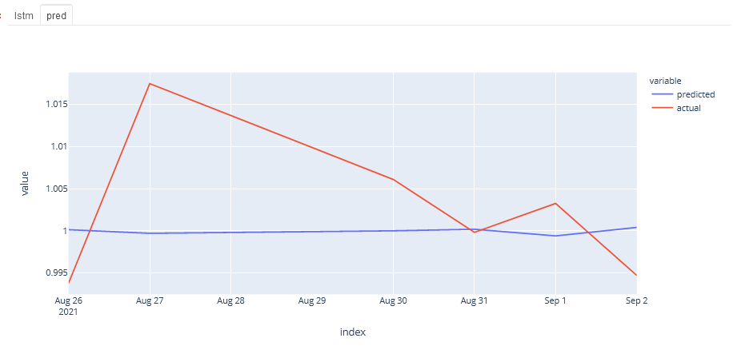

# Project3_Hassan
 
## Overview
The purpose of this project is to build a Machine Learning Platform for Time Series or Sequential Data and make predictions for the future. 
**Note: You will need to get your own .env file to run the programs**
### Architecture
The Architechture is desiged to take:
<ol>
<li>Target Data</li>
<li>Incorporate Exogenous Data</li>
<li>Clean and Create Multi Variate Input Data</li>
<li>Run it through various Machchine Learning Models</li>
<li>Create a dashboard to show the optimal Forecast</li>
</ol> 

### Base Line Implementation
For the project I built a BaseLine System that can be extended in the future. The BaseLine System too: 
<ol>
<li>Input from Alpaca for stock prices</li>
<li>News from NewsAPI</li>
<li>Tones from IBM Tones</li>
<li>Normalized and digitized data</li>
<li>MultiVariate LSTM</li>
<li>Display using</li> 
</ol> 
 

### TOC
[1. Import Alpaca Data](1.---Import-Alpaca--Data) 
[2. NewsAPI](2.---NewsAPI) 
[3. Get Tones from IBM](3.---Get--Tones--from--IBM) 
[4. Integrate data](4.---Integrate--data) 
[5. LSTM](5.---LSTM) 
[6. Dashboard](6.---Dashboard) 
[7. Future Work](7.---Future--Work)
## 1. Import Alpaca Data
I first imported stock prices for the last 30 days and computed the change in daily closing price with the function: 
Target = Log (yt/yt-1) 

## 2. NewsAPI
I then pulled in news on the stock for the 30 days and:
<ol>
<li>Get News Articles on Company in question
<li>Combine “Title”, “Description” and “Content”
<li>Combine with Closing stock Price  and index date
</ol> 

## 3. Get Tones from IBM
I then applied Tones from IBM Tones. For Each Day's Text
<ol>
<li>Compute Document Tone
<li>Compute Sentence Tone
</ol>

The total list of tones from IBM are:  
tone_list = ['excited', 'frustrated','impolite', 'polite', 'sad', 'satisfied', 'sympathetic’,  'anger', 'disgust', 'fear', 'joy', 'sadness’, 'analytical', 'confident', 'tentative’, 'openness_big5', 'conscientiousness_big5', 'extraversion_big5', 'agreeableness_big5',  'emotional_range_big5’]

The tones have the following values:  
Tone values = 0.5 – 1.

## 4. Integrate data
I then cleanded up the data for input into the LSTM 

## 5. LSTM
To run through the LSTM I did the following:
<ol>
<li>Modify the LSTM code to handle multiple input variables
<li>Scale Data
<li>Create 1 day Lagged Data
<li>Split in to 70 /30 For Trian/Test
<li>Simple LSTM
<ol>
<li>Input Layer
<li>Dense Layer
</ol>
<li>Compute and plot accuracy
<li>Inverse Scaling and compare predicted test with actual test 
</ol>

 

## 6. Dashboard
I then displayed the ouput on a Dashboard:
<ol>
<li>Use Plotly Express to plot data
<li>Use Panel to show multiple outputs
</ol>
Below are the charts from the dashboard: 

 
 
## 7. Future Work
These are the tasks for the future:
<ol>
<li>Get Large Data Set 
<li>Additional Exogenous Variables
<ol>
<li>Correlated/Uncorrelated items
<li>Bond Yields
</ol>
<li>Additional ML Methods
<ol>
<li>Regression
<li>Time Series
<li>Reinforcement Learning
</ol>
Parameterize
Run experiments to determine which methods yield best results
</ol>

